# cursor-power 設計ドキュメント

## 設計思想

### なぜ Cursor Agent tab が親なのか

- ユーザーとの対話インターフェースが既にある。新しい UI を作る必要がない
- Agent tab はファイル読み書き、シェル実行、Web 検索など豊富なツールを持つ
- `/` コマンドで明示的にワークフローをトリガーできる

### なぜ `agent` CLI が子なのか

- `agent --print` でヘッドレス実行でき、exit code と JSON 出力で結果を受け取れる
- `--worktree` で隔離された作業環境を自動作成できる
- `--resume <session_id>` でセッションを復帰でき、中断・再開が可能
- `--yolo` で全コマンドを自動承認し、人手介入なしで完走できる
- Cursor のサブスクリプション内のモデルをそのまま使える

### なぜ commands + スクリプトの構成か

| 層 | 役割 | 理由 |
|----|------|------|
| `~/.cursor/commands/*.md` | コマンド認識・エージェントへの指示 | Cursor の公式機能。プロンプトとして注入される |
| `~/.cursor-power/scripts/*.mjs` | 状態管理・プロセス起動・ダッシュボードなど確実性が必要な処理 | エージェント任せだと JSON 形式のブレや git 操作ミスが起きうる |

エージェントの柔軟性（対話、判断）とスクリプトの確実性（ファイル I/O、プロセス管理）を分離する。

### なぜ repo に状態を置かないのか

- 対象レポを汚さない。cursor-power のメタデータが PR に混入しない
- 複数レポを横断してタスクを管理できる
- `~/.cursor-power/` はグローバルなので、どのプロジェクトからでもアクセス可能

## アーキテクチャ

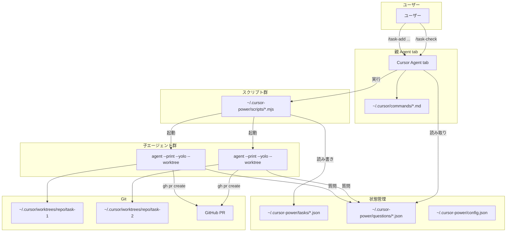

### コンポーネント間の責務

| コンポーネント | 責務 | やらないこと |
|---------------|------|-------------|
| 親 Agent tab | ユーザー対話、コマンド解釈、子への指示中継、結果報告 | ファイル直書き以外の状態管理 |
| commands (`.md`) | コマンド認識、エージェントへのプロンプト注入 | ロジック実行 |
| scripts (`.mjs`) | タスク JSON 読み書き、agent CLI 起動、worktree 管理 | ユーザーとの対話 |
| 子 agent CLI | 実装、commit、push、PR 作成、質問ファイル書き込み | タスク状態の管理 |

## ディレクトリ構造

```
~/.cursor/commands/              # Cursor グローバルコマンド（インストーラーが配置）
  task-plan.md                   # 対話的な仕様策定・タスク起動
  task-add.md                    # 簡易タスク登録
  task-list.md                   # タスク一覧表示
  task-status.md                 # ステータス確認
  task-check.md                  # 質問確認・回答
  task-review.md                 # PR レビュー
  task-clean.md                  # worktree クリーンアップ
  task-config.md                 # 設定変更
  issue-add.md                   # issue 登録
  issue-list.md                  # issue 一覧
  task-promote.md                # issue をタスクに昇格
  dashboard.md                   # Web ダッシュボード起動手順
  tutorial.md                    # 対話型ウォークスルー

~/.cursor-power/                 # グローバル状態管理
  config.json                    # 設定
  issues.json                    # issue メモ
  tasks/                         # タスク状態
    <task-id>.json
  questions/                     # 子からの質問
    <task-id>.json
  logs/                          # 子エージェントのログ
    <task-id>.log
  plans/                         # /task-plan で保存した仕様
    <plan-id>.md
  acceptance/                    # 受け入れテストチェックリスト（親が手動配置）
    <task-id>.json
  scripts/                       # Node.js ヘルパースクリプト
    defaults.mjs                 # 設定キーの既定値（install / update-config で共用）
    paths.mjs                    # 共通パス定義
    prompt.mjs                   # 子エージェントへのプロンプト生成
    add-task.mjs                 # タスク登録
    start-worker.mjs             # 子エージェント起動
    list-tasks.mjs               # タスク一覧
    task-reader.mjs              # タスク読み取り共通モジュール（check-status / dashboard で共用）
    check-status.mjs             # ステータス確認（同期表示 + 非同期更新起動）
    sync-status.mjs              # バックグラウンドでタスク状態を同期 → drain-pending を起動
    dashboard.mjs                # ローカル Web ダッシュボード（127.0.0.1 のみ）
    drain-pending.mjs            # 空き枠で pending タスクを自動起動（FIFO）
    check-questions.mjs          # 質問確認・回答書き込み
    send-answer.mjs              # 子エージェントに回答を中継（resume）
    clean-worktrees.mjs          # worktree クリーンアップ
    run-acceptance.mjs           # 受け入れテスト子の起動（別セッション）
    review-pr.mjs                # PR レビュー（ファイル一覧・diff）
    save-plan.mjs                # 仕様保存
    update-config.mjs            # 設定変更
    manage-issues.mjs            # issue 管理

~/.cursor/worktrees/             # agent CLI が自動管理する worktree
  <repo-name>/
    task-<task-id>/
```

## タスクライフサイクル

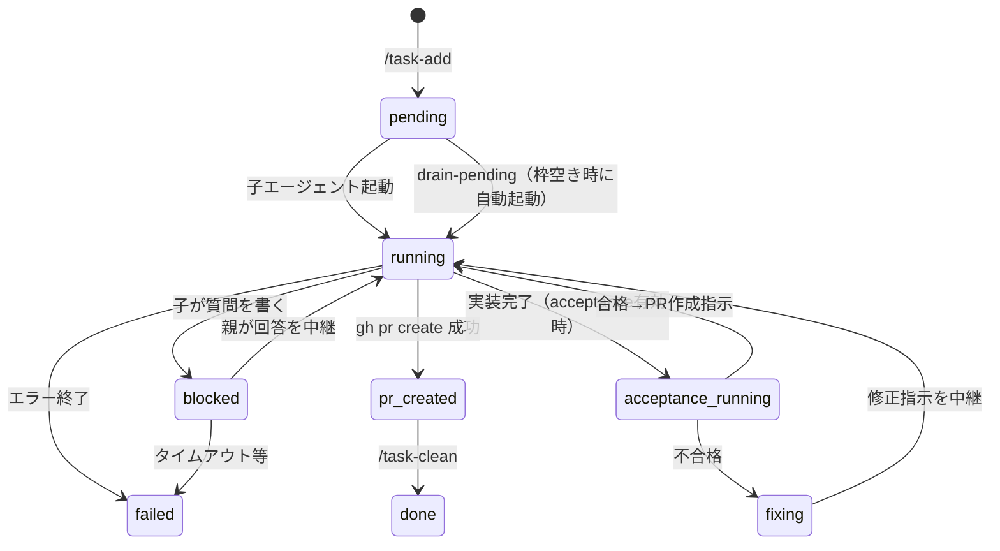

| ステータス | 意味 |
|-----------|------|
| `pending` | タスク登録済み、子エージェント未起動 |
| `running` | 子エージェントが実行中 |
| `blocked` | 子が質問を書いて応答待ち |
| `acceptance_running` | 受け入れテスト子が検証中（`--acceptance` 付きタスクのみ） |
| `fixing` | 受け入れテスト不合格、実装子が修正中（`running` と同様に並列枠を消費） |
| `pr_created` | PR 作成済み、マージ待ち |
| `done` | マージ完了、worktree 削除済み |
| `failed` | エラーで終了 |

## スキーマ

### タスク JSON (`~/.cursor-power/tasks/<task-id>.json`)

```json
{
  "id": "a1b2c3d4",
  "status": "running",
  "prompt": "メール・パスワードによるログイン画面の実装",
  "planId": "e5f6g7h8",
  "sessionId": "aa04a7c8-473c-4b31-a67c-35f3f2b4a447",
  "repoPath": "/Users/shiho/Github/myproject",
  "branch": "task-a1b2c3d4",
  "baseBranch": "main",
  "model": "sonnet-4",
  "prUrl": null,
  "worktreePath": null,
  "pid": 12345,
  "logPath": "~/.cursor-power/logs/a1b2c3d4.log",
  "createdAt": "2026-04-04T10:00:00.000Z",
  "updatedAt": "2026-04-04T10:05:00.000Z"
}
```

| フィールド | 型 | 説明 |
|-----------|-----|------|
| `id` | string | 8文字の短縮 UUID |
| `status` | enum | `pending`, `running`, `blocked`, `acceptance_running`, `fixing`, `pr_created`, `done`, `failed` |
| `prompt` | string | 子エージェントに渡すプロンプト |
| `planId` | string \| null | `/task-plan` で保存した仕様の ID |
| `sessionId` | string \| null | agent CLI のセッション ID（`--resume` で使用） |
| `repoPath` | string | 対象リポジトリの絶対パス |
| `branch` | string | 作業ブランチ名（`task-<id>` または `--type` / `--title` 指定時は `<type>/<title>-<id>` など。`agent --worktree` には `agentWorktreeLabel(branch)`（`/` を `-` にしたもの）だけを渡す） |
| `baseBranch` | string | 分岐元ブランチ |
| `model` | string \| null | 使用モデル（null なら config のデフォルト） |
| `acceptance` | boolean | `true` の場合、PR 前に受け入れテストを実行する |
| `closeIssueId` | number \| null | `--close-issue` で紐づけた issue ID。task-clean 時に `issues.json` から削除される |
| `acceptancePid` | number \| null | 受け入れテスト子エージェントの PID |
| `acceptanceLogPath` | string \| null | 受け入れテスト子のログファイルパス |
| `prUrl` | string \| null | 作成された PR の URL |
| `worktreePath` | string \| null | worktree のパス |
| `pid` | number \| null | 子エージェントプロセスの PID |
| `riskScore` | object \| null | 安全度スコア（`{ impact, likelihood }`）。数値が大きいほど安全（5=問題なし・リスク低、1=リスク高）。詳細は後述 |
| `logPath` | string \| null | ログファイルのパス |
| `createdAt` | string | 作成日時（ISO 8601） |
| `updatedAt` | string | 最終更新日時（ISO 8601） |

### 質問 JSON (`~/.cursor-power/questions/<task-id>.json`)

```json
{
  "taskId": "a1b2c3d4",
  "question": "JWT のシークレットは環境変数から読みますか？",
  "askedAt": "2026-04-04T10:03:00.000Z",
  "answer": null,
  "answeredAt": null
}
```

| フィールド | 型 | 説明 |
|-----------|-----|------|
| `taskId` | string | 対応するタスク ID |
| `question` | string | 子エージェントからの質問 |
| `askedAt` | string | 質問日時 |
| `answer` | string \| null | 親経由のユーザー回答 |
| `answeredAt` | string \| null | 回答日時 |

### Issue JSON (`~/.cursor-power/issues.json`)

```json
[
  {
    "id": 1,
    "text": "ログイン画面の UX を改善したい",
    "createdAt": "2026-04-04T10:00:00.000Z"
  }
]
```

| フィールド | 型 | 説明 |
|-----------|-----|------|
| `id` | number | 連番の ID |
| `text` | string | issue の内容 |
| `createdAt` | string | 作成日時（ISO 8601） |

### 設定 JSON (`~/.cursor-power/config.json`)

```json
{
  "defaultModel": "sonnet-4",
  "maxConcurrency": 3,
  "draftPR": false,
  "autoStartPending": true,
  "dashboardPort": 3820,
  "acceptanceByDefault": false
}
```

| フィールド | 型 | デフォルト | 説明 |
|-----------|-----|-----------|------|
| `defaultModel` | string | `"sonnet-4"` | 子エージェントのデフォルトモデル |
| `maxConcurrency` | number | `3` | 同時実行する子エージェントの最大数 |
| `draftPR` | boolean | `false` | `true` にすると PR をドラフト状態で作成する |
| `autoStartPending` | boolean | `true` | 並列枠に空きが出たとき `pending` タスクを自動起動する |
| `dashboardPort` | number | `3820` | Web ダッシュボードのデフォルトポート |
| `acceptanceByDefault` | boolean | `false` | `true` にすると全タスクで受け入れテストをデフォルト有効にする |

## コマンド別処理フロー

### `/task-add <説明>`

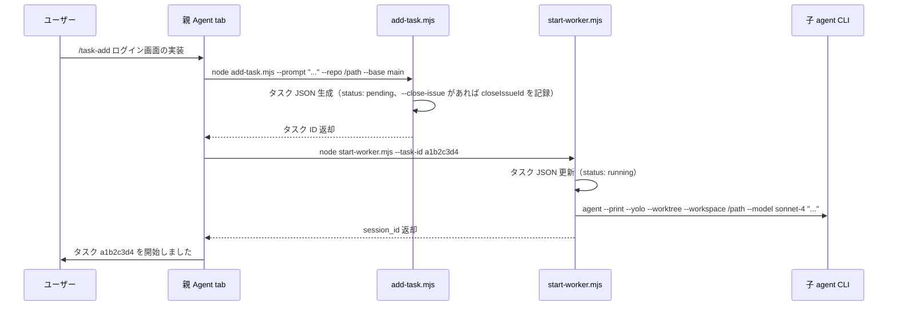

### `/task-list`

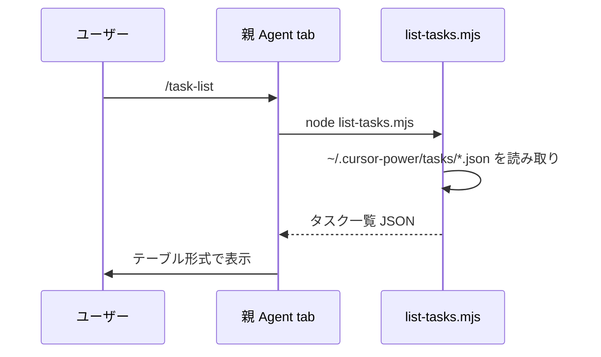

### `/task-status`

check-status.mjs は同期フェーズ（即座にタスク JSON を読み取ってレスポンス）と非同期フェーズ（sync-status.mjs をバックグラウンドで起動して PID 確認・ログ解析・PR 状態を更新）に分離されている。

同期フェーズでも `sessionId` が未設定のタスクはログから補完を試みるため、`/task-status` 実行時点で即座に `sessionId` を取得できる。非同期フェーズ（sync-status.mjs）でも同様にステータスに関係なく `sessionId` をバックフィルするため、`blocked` や `failed` のタスクでも回答中継（`send-answer.mjs`）に必要な `sessionId` が欠落しない。

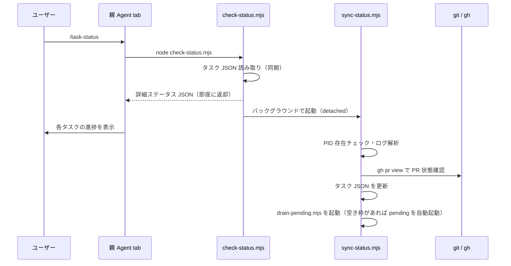

### `/task-check`

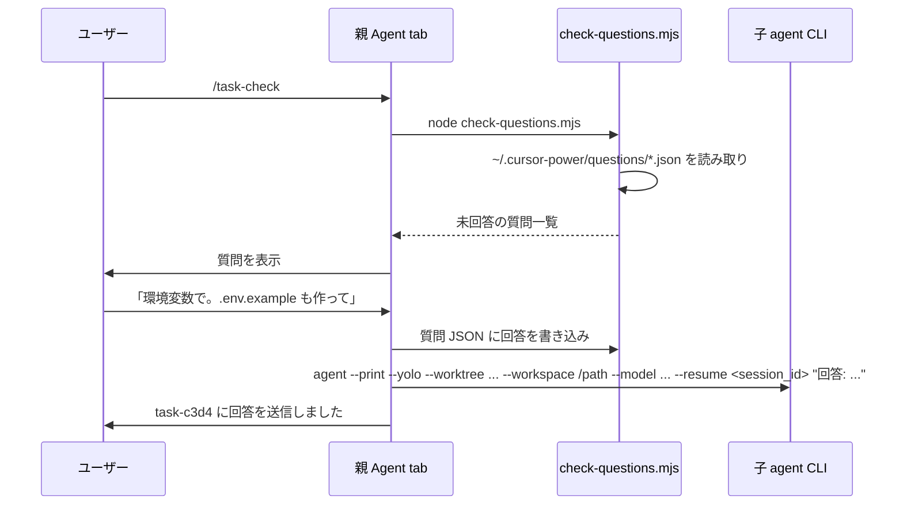

### `/task-clean`

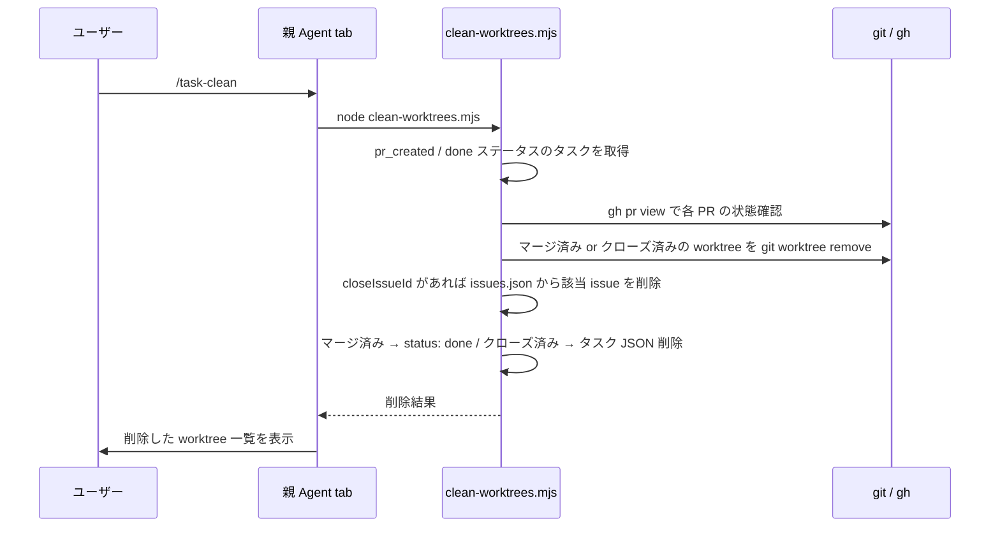

### `/task-plan`

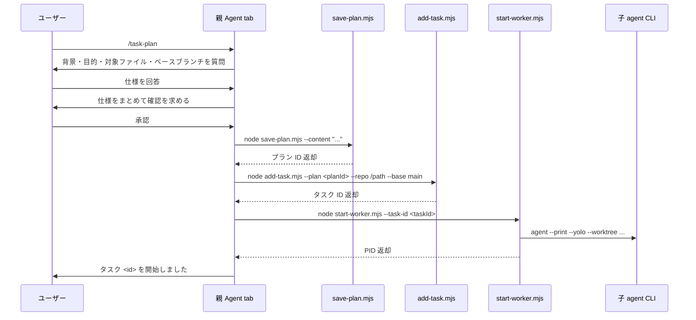

### `/task-review [タスクID]`

差分の基準は `git merge-base ${baseBranch} HEAD`（merge-base）を使用する。これにより `baseBranch` がリモートで進んでいても、GitHub PR の Files changed と同じファイル集合・差分が表示される。

- `getChangedFiles` / `getDiffStat`: `mergeBase..HEAD` で差分を取得
- `--action diff`: 左ペインは `git show ${mergeBase}:${file}` の内容
- `isNew` 判定: `mergeBase` 時点にファイルが存在するかで判定

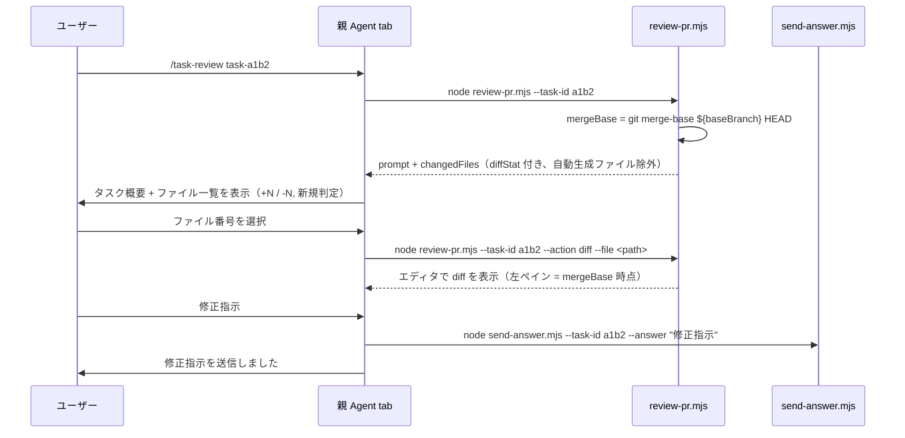

### `/task-config`

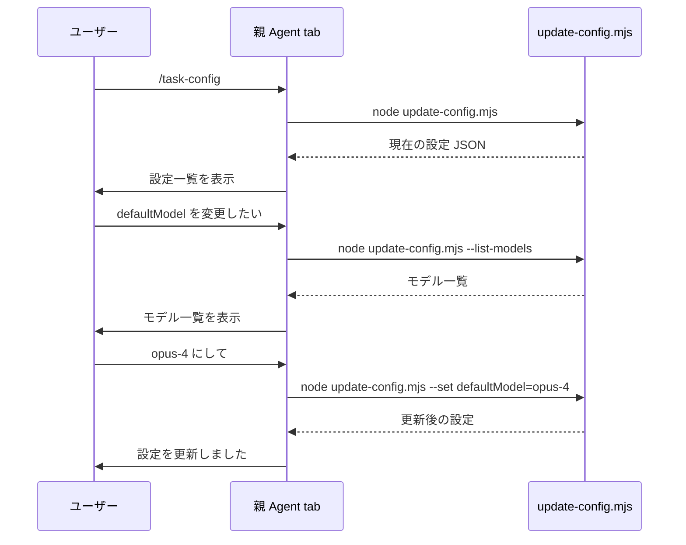

### `/issue-add <メモ>`

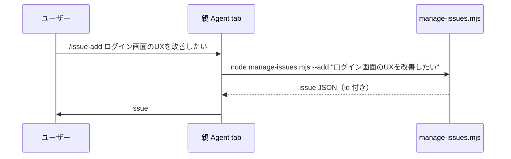

### `/issue-list`

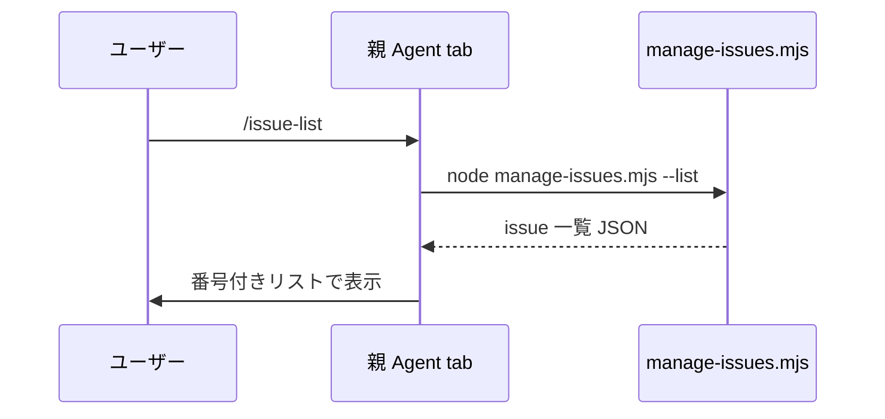

### `/dashboard`

ローカル Web ダッシュボードでタスク状態をリアルタイム監視する。`check-status.mjs` と同じデータソース（`task-reader.mjs`）を使うため表示が矛盾しない。

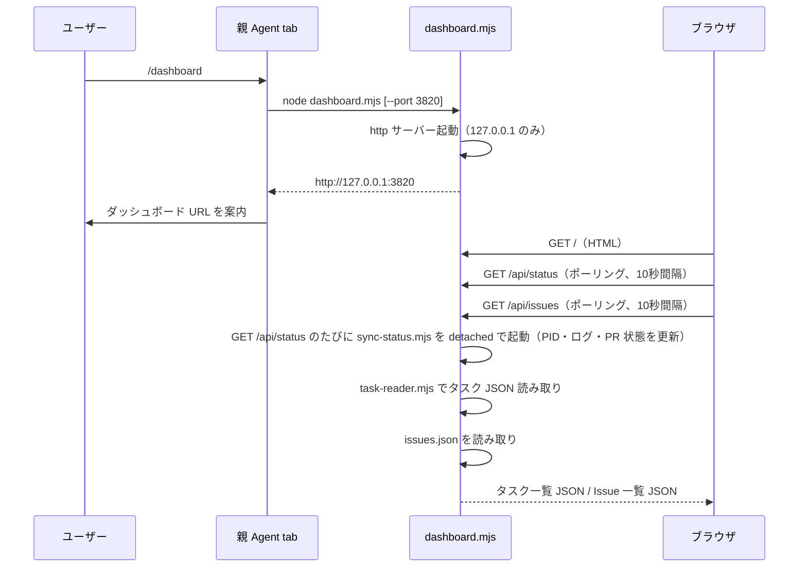

| 項目 | 仕様 |
|------|------|
| バインド | `127.0.0.1` のみ（ローカル専用） |
| ポート | `config.json` の `dashboardPort`（既定 `3820`）。`--port` で上書き可 |
| リアルタイム | ブラウザ側ポーリング（10秒間隔、`/api/status` と `/api/issues` を並行取得）。`/api/status` のたびに `sync-status.mjs` を detached で起動し、PID・ログ・PR 状態を更新 |
| タブ切り替え | ヘッダー下にタブ（「タスク」/「Issues」）。アクティブタブに応じて stats + カード一覧を切り替え |
| レイアウト | 1タスク＝1カード / 1 issue＝1カード。ダークテーマ |
| バッジ表示 | ステータスバッジは短縮ラベルで表示（例: `pending`→`wait`, `acceptance_running`→`acc`）。CSSクラスは内部 status 名のまま |
| タスクカード | id, status, PR URL（なければ「なし」）, プロンプト先頭1〜2行, sessionId の有無, updatedAt |
| Issue カード | id（`#N`）, 本文プレビュー（先頭3行）, createdAt（相対時間） |
| カード詳細モーダル | タスクカードをクリックで prompt 全文・PR URL（リンク）・sessionId・branch・repoPath・createdAt・updatedAt・受け入れテスト状態・質問全文を表示。×ボタン・Esc・オーバーレイクリックで閉じる。カード内リンクはイベント伝播を停止しモーダルを開かない |
| 並び順 | タスク: `updatedAt` 降順（API 側でソート）。Issue: ファイル順（id 昇順） |
| データ共有 | タスクは `task-reader.mjs` を `check-status.mjs` と共用。Issue は `paths.mjs` の `ISSUES_PATH` を `manage-issues.mjs` と共用 |

### 受け入れテストフロー（`--acceptance` 付きタスクのみ）

`--acceptance` フラグ付きで登録されたタスクは、実装完了後に PR を作成する前に受け入れテストを挟む。

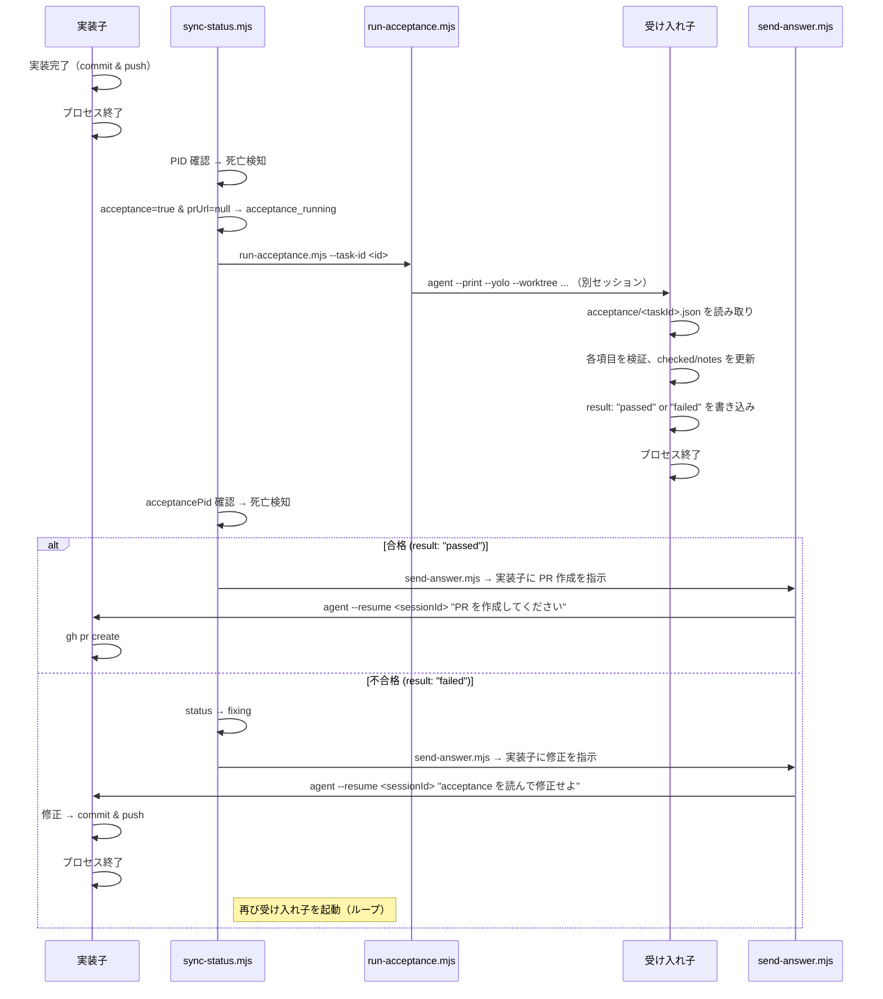

### 受け入れ JSON (`~/.cursor-power/acceptance/<task-id>.json`)

親（ユーザー）が手動で作成する。受け入れ子がチェック結果を書き戻す。

```json
{
  "items": [
    {
      "id": "1",
      "text": "ログインフォームが表示される",
      "checked": false,
      "notes": ""
    },
    {
      "id": "2",
      "text": "バリデーションエラーが表示される",
      "checked": false,
      "notes": ""
    }
  ],
  "result": null,
  "updatedAt": null
}
```

| フィールド | 型 | 説明 |
|-----------|-----|------|
| `items` | array | 受け入れ項目の配列 |
| `items[].id` | string | 項目の識別子 |
| `items[].text` | string | 検証内容の説明 |
| `items[].checked` | boolean | 検証結果（`true` = 合格） |
| `items[].notes` | string | 検証時の備考 |
| `result` | `"passed"` \| `"failed"` \| null | 全体の結果（受け入れ子が書き込む） |
| `updatedAt` | string \| null | 最終更新日時（ISO 8601） |

## 子エージェントへのプロンプト設計

子エージェントに渡すプロンプトは `prompt.mjs` の `buildInitialPrompt()` で生成される。ユーザーが対話で決めた内容をベースに、作業ルール（質問フロー、Git 操作手順、禁止事項）を付加する。`draftPR` 設定が有効な場合は `gh pr create --draft` が指示に含まれる。

質問セクションを Git 操作より前に配置することで、子エージェントが曖昧な仕様を推測で実装する前に必ず質問するよう誘導している。

```
{ユーザーが対話で決めたプロンプト}

---
## 作業ルール

### 質問
- 判断に迷ったり、仕様が不明確な場合は必ず質問すること。
- 仕様に「何を」「どのように」が明確でない場合は、実装前に必ず質問すること。
- 複数の解釈ができる仕様の場合は、質問して確認すること。
- 質問せずに推測で実装することは禁止。迷ったら質問。
- 質問は ~/.cursor-power/questions/{task-id}.json に以下の形式で書く:
  { "taskId": "{task-id}", "question": "質問内容", "askedAt": "ISO 8601 日時" }
- 質問ファイルを書いたら作業を中断し、回答を待つ。それ以上の作業はしないこと。

### Git 操作
- 作業は必ず現在の worktree 内で行うこと。他のディレクトリに移動しない。
- 作業が完了したら以下を順番に実行:
  1. git add で変更をステージ
  2. git commit（Conventional Commits 形式）
  3. git push -u origin HEAD
  4. gh pr create --base {baseBranch} でPRを作成
- PRのタイトルは Conventional Commits 形式にする。

### 禁止事項
- main ブランチへの直接 push
- force push
- worktree 外のファイルの変更
- 質問なしで曖昧な仕様を推測して実装すること
```

回答中継時は `buildResumePrompt()` で簡潔なプロンプトを生成し、`agent --resume <session_id>` で子セッションに送信する。

子エージェントにはレポのコンテキストやアーキテクチャ情報は渡さない。`--workspace` で対象レポを指定するため、子エージェント自身がコードベースを探索して理解する。

### リスクスコア（安全度スケール）

子エージェントは PR 作成前に変更の安全度を `riskScore` として評価する。**数値が大きいほど安全**。

| フィールド | 意味 | 1（リスク高） | 5（安全） |
|-----------|------|-------------|----------|
| `impact` | 影響の小ささ | 影響範囲が広く障害が重い可能性 | 局所的・影響は軽微で問題になりにくい |
| `likelihood` | 発生しにくさ | 欠陥が入りやすく不確実 | バグが入る余地がほぼない |

安全な変更では `impact=5, likelihood=5` を付ける。`/task-review` では「安全度: 影響の小ささ N/5, 発生しにくさ N/5」の形式で表示する。

## 並列実行の制御

- `config.json` の `maxConcurrency` で上限を制御
- `add-task.mjs` が起動前に `running` + `blocked` + `fixing` + `acceptance_running` ステータスのタスク数を数え、上限に達していれば `pending` のまま待機
- `start-worker.mjs` はバックグラウンドプロセスとして agent CLI を起動し、即座に制御を返す

### pending の自動起動（drain-pending）

`sync-status.mjs` がタスク状態を更新したあと、`drain-pending.mjs` をバックグラウンドで起動する。`drain-pending.mjs` は以下のロジックで `pending` タスクを自動起動する:

1. `config.autoStartPending` が `false` なら何もしない
2. `activeCount` = `running` + `blocked` + `fixing` + `acceptance_running` の件数を算出
3. `freeSlots` = `maxConcurrency` − `activeCount`。0 以下なら終了
4. `pending` タスクを `createdAt` 昇順（FIFO）でソート
5. `freeSlots` 分だけ先頭から取り出し、各タスクの JSON を再読込して**まだ `pending`** のときだけ `start-worker.mjs` を `spawn`（detached）で実行

これにより、タスクが `done` / `pr_created` / `failed` に遷移して枠が空くと、次の `/task-status` 実行時に待ち行列の `pending` が自動で `running` に移る。

## リカバリ

親 Agent tab のセッションが切れても、以下の情報から復帰可能:

1. `~/.cursor-power/tasks/*.json` — 全タスクの状態
2. 各タスクの `sessionId` — `agent --resume` で子セッション復帰（`send-answer.mjs` は初回起動と同じ `--workspace` / `--worktree` / `--worktree-base` / `--model` を付与して再開するため、再開後も正しい worktree で作業が継続される）
3. worktree の実体 — `~/.cursor/worktrees/` に残っている

新しい Agent tab セッションで `/task-list` を実行すれば、全タスクの現在状態を確認できる。`/task-check` で未回答の質問も拾える。
