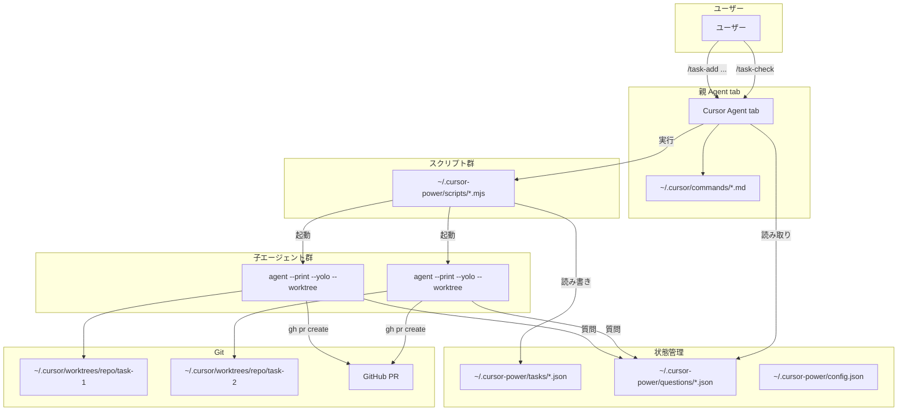
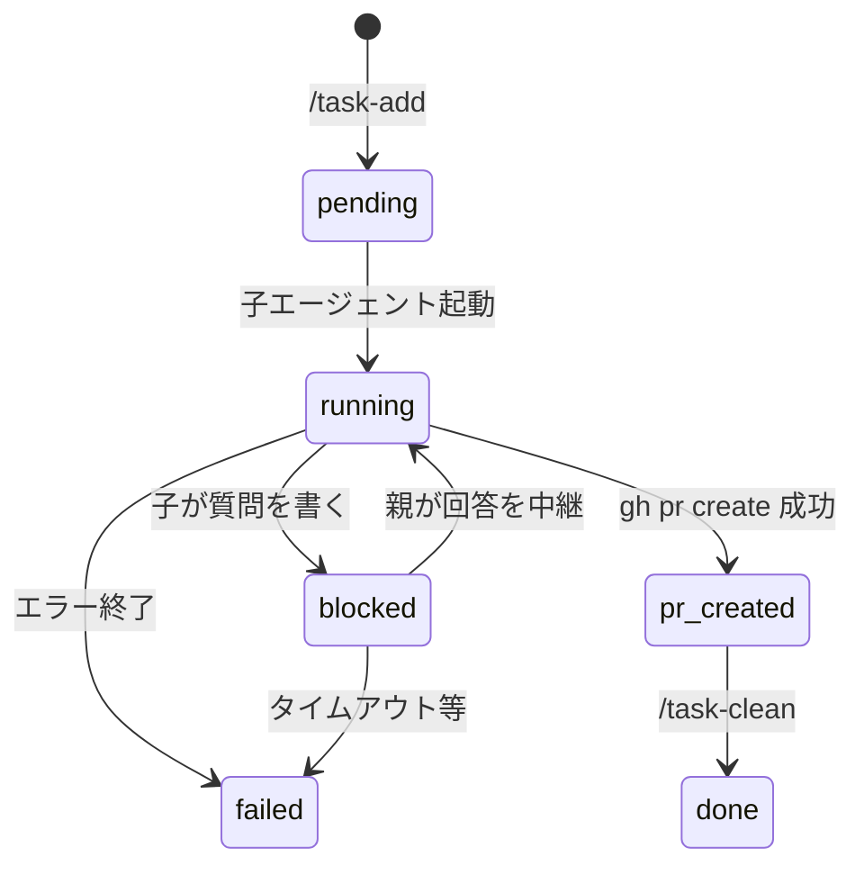
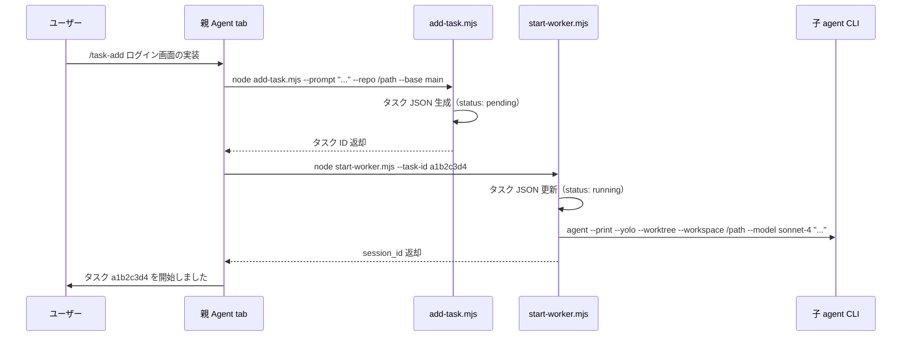
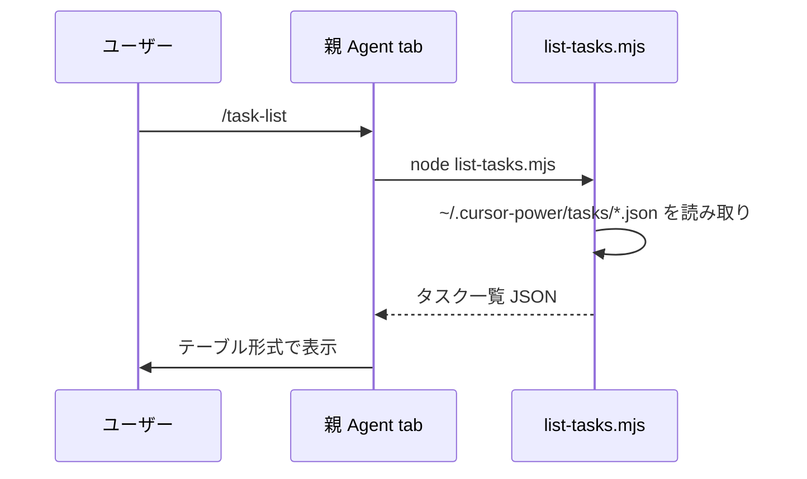
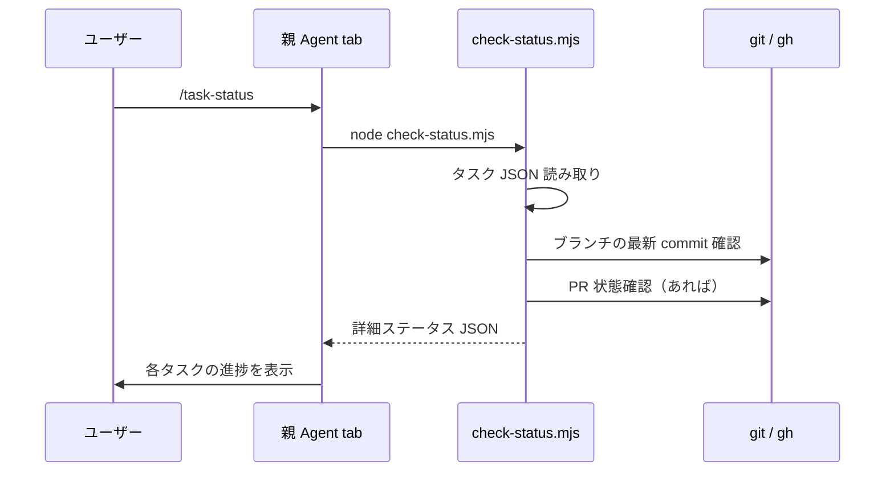
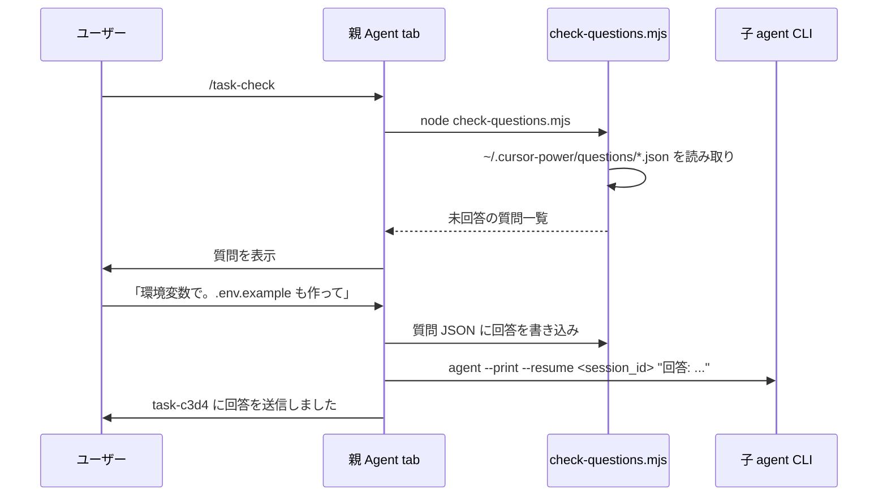
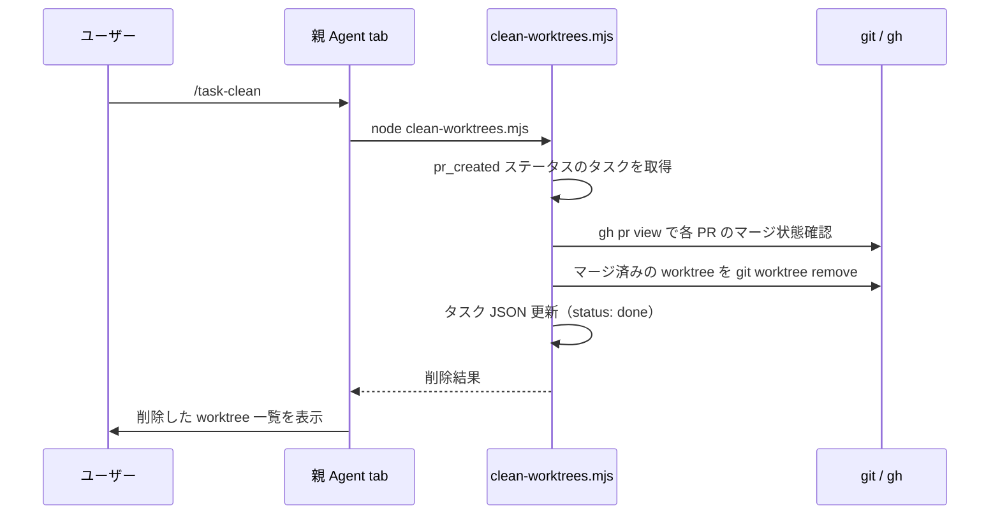

# cursor-power 設計ドキュメント

## 設計思想

### なぜ Cursor Agent tab が親なのか

- ユーザーとの対話インターフェースが既にある。新しい UI を作る必要がない
- Agent tab はファイル読み書き、シェル実行、Web 検索など豊富なツールを持つ
- `/` コマンドで明示的にワークフローをトリガーできる

### なぜ `agent` CLI が子なのか

- `agent --print` でヘッドレス実行でき、exit code と JSON 出力で結果を受け取れる
- `--worktree` で隔離された作業環境を自動作成できる
- `--resume <session_id>` でセッションを復帰でき、中断・再開が可能
- `--yolo` で全コマンドを自動承認し、人手介入なしで完走できる
- Cursor のサブスクリプション内のモデルをそのまま使える

### なぜ commands + スクリプトの構成か

| 層 | 役割 | 理由 |
|----|------|------|
| `~/.cursor/commands/*.md` | コマンド認識・エージェントへの指示 | Cursor の公式機能。プロンプトとして注入される |
| `~/.cursor-power/scripts/*.mjs` | 状態管理・プロセス起動など確実性が必要な処理 | エージェント任せだと JSON 形式のブレや git 操作ミスが起きうる |

エージェントの柔軟性（対話、判断）とスクリプトの確実性（ファイル I/O、プロセス管理）を分離する。

### なぜ repo に状態を置かないのか

- 対象レポを汚さない。cursor-power のメタデータが PR に混入しない
- 複数レポを横断してタスクを管理できる
- `~/.cursor-power/` はグローバルなので、どのプロジェクトからでもアクセス可能

## アーキテクチャ



### コンポーネント間の責務

| コンポーネント | 責務 | やらないこと |
|---------------|------|-------------|
| 親 Agent tab | ユーザー対話、コマンド解釈、子への指示中継、結果報告 | ファイル直書き以外の状態管理 |
| commands (`.md`) | コマンド認識、エージェントへのプロンプト注入 | ロジック実行 |
| scripts (`.mjs`) | タスク JSON 読み書き、agent CLI 起動、worktree 管理 | ユーザーとの対話 |
| 子 agent CLI | 実装、commit、push、PR 作成、質問ファイル書き込み | タスク状態の管理 |

## ディレクトリ構造

```
~/.cursor/commands/              # Cursor グローバルコマンド（インストーラーが配置）
  task-add.md
  task-list.md
  task-status.md
  task-check.md
  task-clean.md

~/.cursor-power/                 # グローバル状態管理
  config.json                    # 設定
  tasks/                         # タスク状態
    <task-id>.json
  questions/                     # 子からの質問
    <task-id>.json
  scripts/                       # Node.js ヘルパースクリプト
    add-task.mjs                 # タスク登録
    list-tasks.mjs               # タスク一覧
    check-status.mjs             # ステータス確認
    check-questions.mjs          # 質問確認
    clean-worktrees.mjs          # worktree クリーンアップ
    start-worker.mjs             # 子エージェント起動

~/.cursor/worktrees/             # agent CLI が自動管理する worktree
  <repo-name>/
    <task-id>/
```

## タスクライフサイクル



| ステータス | 意味 |
|-----------|------|
| `pending` | タスク登録済み、子エージェント未起動 |
| `running` | 子エージェントが実行中 |
| `blocked` | 子が質問を書いて応答待ち |
| `pr_created` | PR 作成済み、マージ待ち |
| `done` | マージ完了、worktree 削除済み |
| `failed` | エラーで終了 |

## スキーマ

### タスク JSON (`~/.cursor-power/tasks/<task-id>.json`)

```json
{
  "id": "a1b2c3d4",
  "status": "running",
  "prompt": "メール・パスワードによるログイン画面の実装",
  "sessionId": "aa04a7c8-473c-4b31-a67c-35f3f2b4a447",
  "repoPath": "/Users/shiho/Github/myproject",
  "branch": "task-a1b2c3d4",
  "baseBranch": "main",
  "model": "sonnet-4",
  "prUrl": null,
  "worktreePath": "~/.cursor/worktrees/myproject/task-a1b2c3d4",
  "createdAt": "2026-04-04T10:00:00.000Z",
  "updatedAt": "2026-04-04T10:05:00.000Z"
}
```

| フィールド | 型 | 説明 |
|-----------|-----|------|
| `id` | string | 8文字の短縮 UUID |
| `status` | enum | `pending`, `running`, `blocked`, `pr_created`, `done`, `failed` |
| `prompt` | string | 子エージェントに渡すプロンプト |
| `sessionId` | string \| null | agent CLI のセッション ID（`--resume` で使用） |
| `repoPath` | string | 対象リポジトリの絶対パス |
| `branch` | string | 作業ブランチ名 |
| `baseBranch` | string | 分岐元ブランチ |
| `model` | string \| null | 使用モデル（null なら config のデフォルト） |
| `prUrl` | string \| null | 作成された PR の URL |
| `worktreePath` | string \| null | worktree のパス |
| `createdAt` | string | 作成日時（ISO 8601） |
| `updatedAt` | string | 最終更新日時（ISO 8601） |

### 質問 JSON (`~/.cursor-power/questions/<task-id>.json`)

```json
{
  "taskId": "a1b2c3d4",
  "question": "JWT のシークレットは環境変数から読みますか？",
  "askedAt": "2026-04-04T10:03:00.000Z",
  "answer": null,
  "answeredAt": null
}
```

| フィールド | 型 | 説明 |
|-----------|-----|------|
| `taskId` | string | 対応するタスク ID |
| `question` | string | 子エージェントからの質問 |
| `askedAt` | string | 質問日時 |
| `answer` | string \| null | 親経由のユーザー回答 |
| `answeredAt` | string \| null | 回答日時 |

### 設定 JSON (`~/.cursor-power/config.json`)

```json
{
  "defaultModel": "sonnet-4",
  "maxConcurrency": 3
}
```

| フィールド | 型 | デフォルト | 説明 |
|-----------|-----|-----------|------|
| `defaultModel` | string | `"sonnet-4"` | 子エージェントのデフォルトモデル |
| `maxConcurrency` | number | `3` | 同時実行する子エージェントの最大数 |

## コマンド別処理フロー

### `/task-add <説明>`



### `/task-list`



### `/task-status`



### `/task-check`



### `/task-clean`



## 子エージェントへのプロンプト設計

子エージェントに渡すプロンプトは、ユーザーが対話で決めた内容をベースに、最小限のシステム指示を付加する。

```
{ユーザーが対話で決めたプロンプト}

---
質問がある場合は ~/.cursor-power/questions/{task-id}.json に以下の形式で書いてください:
{
  "taskId": "{task-id}",
  "question": "質問内容",
  "askedAt": "ISO 8601 日時"
}
質問を書いたら作業を中断し、回答を待ってください。

完了したら gh pr create でPRを作成してください。
```

子エージェントにはレポのコンテキストやアーキテクチャ情報は渡さない。`--workspace` で対象レポを指定するため、子エージェント自身がコードベースを探索して理解する。

## 並列実行の制御

- `config.json` の `maxConcurrency` で上限を制御
- `add-task.mjs` が起動前に `running` + `blocked` ステータスのタスク数を数え、上限に達していれば `pending` のまま待機
- `start-worker.mjs` はバックグラウンドプロセスとして agent CLI を起動し、即座に制御を返す

## リカバリ

親 Agent tab のセッションが切れても、以下の情報から復帰可能:

1. `~/.cursor-power/tasks/*.json` — 全タスクの状態
2. 各タスクの `sessionId` — `agent --resume` で子セッション復帰
3. worktree の実体 — `~/.cursor/worktrees/` に残っている

新しい Agent tab セッションで `/task-list` を実行すれば、全タスクの現在状態を確認できる。`/task-check` で未回答の質問も拾える。
