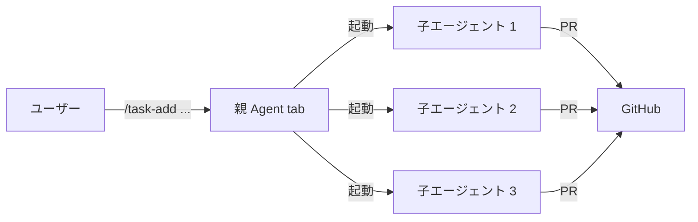

# cursor-power

[](https://www.npmjs.com/package/cursor-power)
[](LICENSE)

Cursor Agent tab を**並列実装ワーカーの実行基盤**として使う最小オーケストレーション層。

親（Agent tab）がユーザーと対話しながらタスクを管理し、複数の子エージェント（`agent` CLI）が独立 worktree で **実装 → commit → push → PR 作成** まで自動実行する。



## 特徴

- **グローバルコマンド** — `~/.cursor/commands/` に配置。どのリポジトリの Agent tab でも `/task-*` コマンドが使える
- **並列実装** — 最大 3 つ（設定可能）の子エージェントが同時に独立した worktree で作業
- **ファイルベースの状態管理** — `~/.cursor-power/` にタスク状態・質問・設定を保存。DB 不要
- **質問フロー** — 子エージェントが判断に迷ったらファイルに質問を書き、親経由でユーザーに確認
- **PR 自動生成** — 子エージェントが commit → push → `gh pr create` まで完了
- **対話レビュー** — `/task-review` で diff を確認し、修正指示を子エージェントに送信

## 前提条件

| ツール | バージョン | 用途 |
|--------|-----------|------|
| [Cursor](https://cursor.com/) | — | Agent tab（親エージェント） |
| [Cursor Agent CLI](https://cursor.com/cli) (`agent`) | — | 子エージェントの実行 |
| [GitHub CLI](https://cli.github.com/) (`gh`) | — | PR 作成・状態確認 |
| [Node.js](https://nodejs.org/) | >= 18 | スクリプト実行 |
| [Git](https://git-scm.com/) | — | worktree 管理・ブランチ操作 |

## インストール

```bash
npm install -g cursor-power
cursor-power install
```

`cursor-power install` は以下を行う:

1. `~/.cursor/commands/` にコマンドファイル（`.md`）を配置
2. `~/.cursor-power/` に状態管理ディレクトリとスクリプトを作成
3. `~/.cursor-power/config.json` にデフォルト設定を生成

## クイックスタート

インストール後、Cursor の Agent tab で以下を実行するだけ:

```
/task-add ログイン画面を実装する
```

これだけで子エージェントが起動し、独立した worktree でコードを書き、PR を作成してくれる。

より丁寧に仕様を詰めたい場合は `/task-plan` を使う:

```
/task-plan
```

対話形式で背景・目的・対象ファイル・ベースブランチをヒアリングし、仕様が固まってからタスクを起動する。

> **はじめての方へ** — `/tutorial` コマンドを実行すると、ダミータスクを使って一通りのフローを体験できるウォークスルーが始まります。

## コマンド一覧

Cursor の Agent tab で `/` に続けて入力する。

### タスク管理

| コマンド | 説明 |
|----------|------|
| `/task-plan` | 対話で仕様を詰めてからタスクを登録・起動（推奨） |
| `/task-add <説明>` | ワンライナーでタスク登録 → 子エージェント自動起動 |
| `/task-list` | 全タスクの一覧を表示 |
| `/task-status` | 各タスクの進捗・最新 commit・PR 状態を確認 |
| `/task-check` | 子エージェントからの未回答の質問を確認し、回答を中継 |
| `/task-review [タスクID]` | PR の diff を確認し、修正指示を送信 |
| `/task-clean` | マージ済み・クローズ済み PR の worktree とブランチを削除 |
| `/task-config` | 設定を対話的に変更（モデル、同時実行数など） |

### Issue 管理

| コマンド | 説明 |
|----------|------|
| `/issue-add <メモ>` | アイデアや改善点を軽量 issue として記録 |
| `/issue-list` | 登録済み issue の一覧を表示 |

### その他

| コマンド | 説明 |
|----------|------|
| `/tutorial` | ダミータスクで一通りのフローを体験するウォークスルー |

## 使い方

### 仕様を詰めてタスクを起動

```
ユーザー: /task-plan
Agent:    背景・目的・対象ファイル・ベースブランチを質問
ユーザー: （仕様を回答）
Agent:    仕様をまとめて確認 → 承認後、タスク起動
```

### 進捗を確認

```
ユーザー: /task-status

Agent: タスク一覧:
  task-a1b2: ログイン画面 [running] — 3 commits, 2分前に更新
  task-c3d4: API認証     [blocked] — 質問あり
```

### 子エージェントの質問に回答

```
ユーザー: /task-check

Agent: task-c3d4 から質問:
  「JWT のシークレットは環境変数から読みますか？」

ユーザー: 環境変数で。.env.example も作って。
Agent:    task-c3d4 に回答を送信しました。
```

### PR をレビュー

```
ユーザー: /task-review task-a1b2

Agent: 変更ファイル:
  1. src/components/auth/LoginForm.tsx (+85 / -0) 新規
  2. src/components/auth/index.ts      (+3 / -0)  新規
  3. src/styles/auth.css               (+42 / -0) 新規

ユーザー: 1
Agent:    （diff をエディタで表示）

ユーザー: バリデーションエラーの表示を各フィールドの下に出して。
Agent:    修正指示を task-a1b2 に送信しました。
```

### クリーンアップ

```
ユーザー: /task-clean

Agent: マージ済み worktree を削除:
  ✓ task-a1b2 (PR #42 merged) — worktree・ブランチ削除完了
```

## 設定

`~/.cursor-power/config.json`:

```json
{
  "defaultModel": "sonnet-4",
  "maxConcurrency": 3,
  "draftPR": false
}
```

| キー | 型 | デフォルト | 説明 |
|------|----|-----------|------|
| `defaultModel` | string | `"sonnet-4"` | 子エージェントのデフォルトモデル |
| `maxConcurrency` | number | `3` | 同時実行する子エージェントの最大数 |
| `draftPR` | boolean | `false` | `true` にすると PR をドラフト状態で作成 |

設定は `/task-config` コマンドで対話的に変更できる。

## ディレクトリ構成

### ソースツリー（npm パッケージ）

```
cursor-power/
  bin/cursor-power.mjs       # CLI エントリポイント (cursor-power install)
  commands/                   # Cursor グローバルコマンド (.md)
    task-plan.md
    task-add.md
    task-list.md
    task-status.md
    task-check.md
    task-review.md
    task-clean.md
    task-config.md
    issue-add.md
    issue-list.md
    tutorial.md
  scripts/                    # Node.js ヘルパースクリプト (.mjs)
    paths.mjs                 # 共通パス定義
    prompt.mjs                # 子エージェントへのプロンプト生成
    add-task.mjs              # タスク登録
    start-worker.mjs          # 子エージェント起動
    list-tasks.mjs            # タスク一覧
    check-status.mjs          # ステータス確認
    check-questions.mjs       # 質問確認・回答書き込み
    send-answer.mjs           # 回答中継（agent --resume）
    clean-worktrees.mjs       # worktree クリーンアップ
    review-pr.mjs             # PR レビュー（diffStat 付き）
    save-plan.mjs             # 仕様保存
    update-config.mjs         # 設定変更
    manage-issues.mjs         # issue 管理
    sync-status.mjs           # ステータス同期
```

### インストール先（実行時）

```
~/.cursor/commands/           # Cursor グローバルコマンド
~/.cursor-power/              # 状態管理
  config.json                 # グローバル設定
  issues.json                 # issue メモ
  tasks/<task-id>.json        # タスク状態
  questions/<task-id>.json    # 子からの質問
  logs/<task-id>.log          # 子エージェントのログ
  plans/<plan-id>.md          # /task-plan で保存した仕様
  scripts/*.mjs               # ヘルパースクリプト
~/.cursor/worktrees/          # agent CLI が自動管理する worktree
  <repo-name>/task-<id>/
```

## 関連ドキュメント

| ドキュメント | 内容 |
|-------------|------|
| [DESIGN.md](DESIGN.md) | アーキテクチャ・設計思想・データスキーマ・処理フロー図 |
| [TODO.md](TODO.md) | 実装ロードマップと完了済み機能の記録 |
| [CHANGELOG.md](CHANGELOG.md) | バージョンごとの変更履歴 |

## コントリビューション

Issue やプルリクエストを歓迎します。

## ライセンス

MIT
